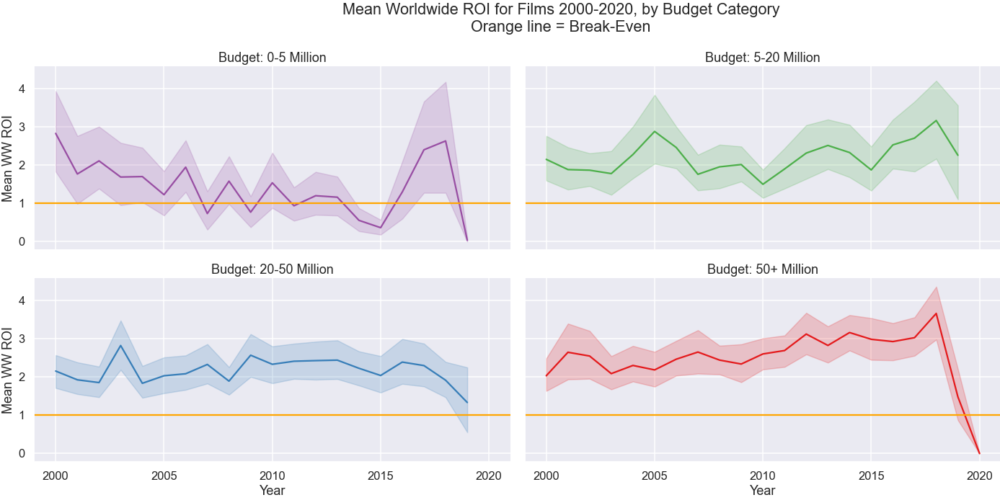
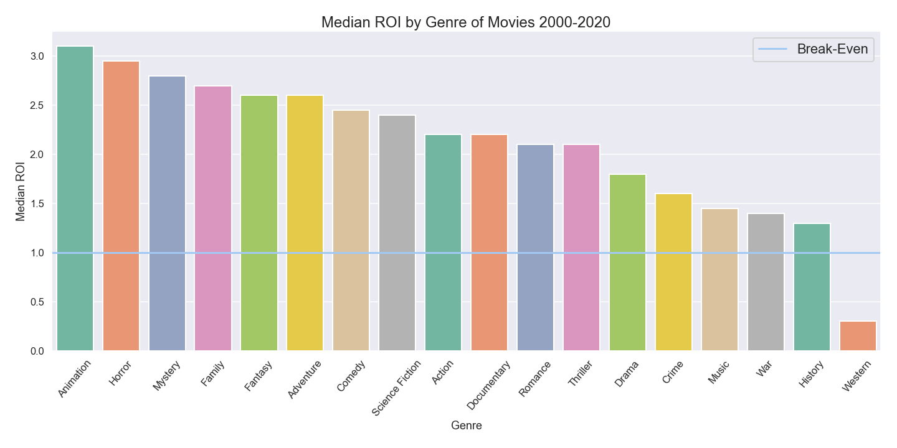
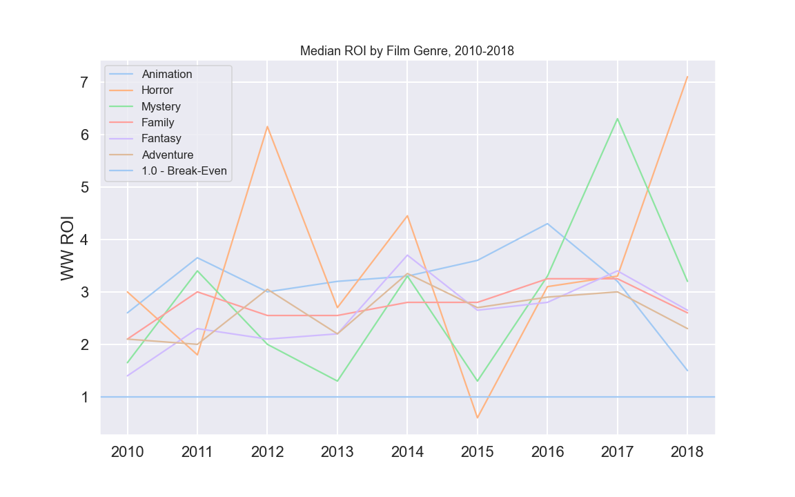

# Data Science, Module 1

## Final Project Submission

* Student name: **William Dougherty**
* Student pace: **self paced**
* Scheduled project review date/time: **Friday April 16, 11:00 AM**
* Instructor name: **Jeff Herman**

## Overview

In this project, I will be exploring data on movies from various sources in order to answer the overall question:

"What type of films are currently doing the best at the box office?"

This is in the context of a hypothetical situation in which I am making recommendations to a large company that is looking to enter the film-making business (i.e. Microsoft) as to what parameters should guide their film development process.

The prompt given by Flatiron is as follows:

Microsoft sees all the big companies creating original video content, and they want to get in on the fun. They have decided to create a new movie studio, but the problem is they don’t know anything about creating movies. They have hired you to help them better understand the movie industry.
Your team is charged with doing data analysis and creating a presentation that explores what type of films are currently doing the best at the box office. You must then translate those findings into actionable insights that the CEO can use when deciding what type of films they should be creating.

## 1. Notebook - student.ipynb

This is the main file with all code, visualizations, and explanations.

Overall, I am attempting to examine how two main aspects - production budget, and genre - influence the profitability of a film. I do so by using a few different datasets, as well as a small amount of data requested from an API, to analyze these parameters. I utilized Pandas to organize and manipulate the data, and Matplotlib and Seaborn to visualize the findings.

### A. Initial exploration
Here, I import and organize the datasets, and do some initial analysis; I calculate basic budget/revenue figures, like ROI and net revenue.
### B. 1st Question
"What are the distributions of ROI (revenue/budget), for domestic and worldwide contexts?"

I organized recent films (2000-2020) into four budget categories, 0-5 / 5-20 / 20-50 / 50+ million dollars. I used the ROI data from the initial exploration to create a boxplot of these categories, and created separate versions for the worldwide and domestic ROI contexts. As well, I included a horizontal 'break-even' line to show the 1.0 ROI point, above which films turn a profit.

We can conclude that Worldwide ROI is much higher, so that should be prioritized over domestic.

As well, films of $5,000,000 budget and higher should be prioritized; and the more spent, the more earned, both proportionally and in raw profit.

### C. 2nd Question
"Are there any trends or clear winners in Worlwide ROI and Net Revenue over time, from 2000-2020?"

Here, I look at the four categories from Question 1 over time, in both Worldwide ROI and Net Revenue. In order to remove extreme outliers, I looked at the distribution of ROI's, and determined that anything above 10.0 is an extreme outlier, as shown below. There are films of 200/300/450 million, but so few that they don't appear on this histogram.

Just because it's so pretty, here's a zoomed-in look at films with ROI < 15:

And here, we see the Mean ROI and Mean Net Revenue as a grid of line plots (a Seaborn relplot), with a shaded area that denotes the 95% confidence interval. Again, a break-even line is shown. 

We can conclude again that films of $5+ million are the most profitable, but that in terms of net revenue, the 50+ million category is the clear winner, and is the only category with a clear upward trajectory.

### D. 3rd Question
"What film genres have the highest median Worldwide ROI?"

In order to investigate genre, I merged the previous data with data from TheMovieDB.org, and requested the genre ID information from its API. I then categorized all the genres listed, and ordered them by their Median ROI, again with a break-even line.

We can see that Animation, Horror, Mystery, Family, Fantasy, and Adventure are the top 6, having ROI's over 2.5. Westerns, History, War, and Music are the lowest performers.

Again, I'd like to see how these categories trend over time.
### E. 4th Question
"Are there any trends in these genres from 2010-2018?"

Due to a lack of data for many genres over certain years (2000-2009, 2019-2020) I narrowed this section to 2010-2018. Similar to Question 2, I plotted the genre data across the years, as a layered line plot, showing the median ROI for the top 6 genres.

This is somewhat inconclusive, but we can draw a few conclusions. Most are profitable, and don't seem to have a strong trajectory over the time period - thus, all would be strong candidates to prioritize in a prospective film production.

Horror and Mystery films seem most volatile, with high peaks but low valleys.

### F. Overall Conclusions

- It's very clear that worldwide profitability should be prioritized, as most domestic ROI's are below 1.0 (break-even).
- A threshold of $5 million dollars is the point at which worldwide ROI is above the break-even point; and the more
money invested, the more of a return is generated.
- We saw that the highest category ($50 million plus) is a clear winner in terms of net revenue over the period
2000-2020, and it is the only with a clear upward trend.
- The lowest category, $0-5 Million, is the clear loser in both measures - or at least, it has low risk, but low reward.
- In terms of genre, questions 3 and 4 show that most genres have at least some profitability potential.
- Westerns are the clear losers here, and History, War, and Music films aren't much better.
- When looking at the top genres, Animation, Horror, Mystery, etc are most profitable, but some (Horror, Mystery) can
be more volatile over time.

### G. Future Work
These are some other areas that are worth investigation and further study:
- Because of profitability of Worldwide revenue, investigate reasons for success vs. failure in global marketing and distribution
- Investigate intersection of budget and genre
- Investigate data on streaming platforms, because they exist outside of traditional ‘box office’ profit framework
- Incorporate data from 2020/2021 and impact of Covid on industry
- Investigate data on impact of  films’ principals - Directors, Actors, Producers

## 2. Presentation Slides - presentation.pdf

This is a non-technical presentation of the goals, questions, and findings of my notebook above.

## 3. Blog Post and Video Walkthrough

The blog post and video walkthrough are linked here:

[Blog Post](https://willcd.medium.com/data-science-for-the-silver-screen-2fd4a604de5d)

[Video Walkthrough](http://)